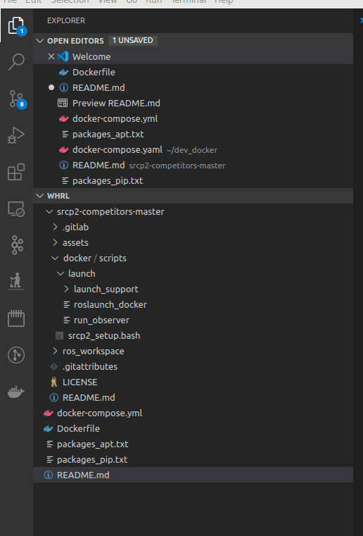

# ML-graspnet-docker

## Installation

1. Install [docker](https://docs.docker.com/engine/install/ubuntu/)
2. Install Nvidia drivers
    ```bash
    # My graphics card supports 455, so it is here. Change this as per your need/GPU
    sudo apt update && sudo apt install nvidia-driver-455
    ```
3. Install Nvidia docker support
    ```bash
    # Add the package repositories
    distribution=$(. /etc/os-release;echo $ID$VERSION_ID)
    curl -s -L https://nvidia.github.io/nvidia-docker/gpgkey | sudo apt-key add -
    curl -s -L https://nvidia.github.io/nvidia-docker/$distribution/nvidia-docker.list | sudo tee /etc/apt/sources.list.d/nvidia-docker.list

    # install the nvidia docker support packages
    sudo apt-get update 
    sudo apt-get install nvidia-container-toolkit

    # restart the docker daemon with nvidia support
    sudo systemctl restart docker
    ```

4. Install and configure nvidia runtime support to docker daemon
        
    ```bash 
    distribution=$(. /etc/os-release;echo $ID$VERSION_ID)
    curl -s -L https://nvidia.github.io/nvidia-container-runtime/$distribution/nvidia-container-runtime.list |   sudo tee /etc/apt/sources.list.d/nvidia-container-runtime.list

    sudo apt update
    sudo apt install nvidia-container-runtime
    
        
5. create a new file at `/etc/docker/daemon.json` with the following contents. If this file already exists, add the contents to existing configuration

    ```json
    {
        "runtimes": {
        "nvidia": {
            "path": "/usr/bin/nvidia-container-runtime",
            "runtimeArgs": []
        }
        }
    }
    ```
6. Install python3.7 and pip
    ```bash
    sudo apt install python3.7 python3-pip
    ```

7. Install docker-compose
    ```bash
    sudo python3.7 -m pip install docker-compose
    ```
    
## Download the repositories (If not done already)
8. Download the graspnet repository. 

    ```bash
    ## Cloning simulation repository.
    cd && git clone https://github.com/jsll/pytorch_6dof-graspnet.git
    ```
    
## Making Aliases
Open the `.bashrc` file in your favourite container. You can open it using `vim ~/.bashrc`. Insert following lines in it:
```bash
export DOCKER_DIR="$HOME/ML-graspnet-docker" 

alias dev_doc_up="cd $DOCKER_DIR/ && docker-compose up -d dev" # -d runs the container in background
alias dev_doc_down="cd $DOCKER_DIR/ && docker-compose down"
```

## Starting development container
Using the aliases used above, you can start the development docker with:
```bash
    dev_doc_up
```
## Connect VScode to docker container

Download and install the [VScode](https://code.visualstudio.com/) if you do not have it installed.

Install the following extensions for VSCode
1. Docker
2. Remote-containers

Click on Docker extension, right click on the running container from previous step and click Attach Visual Studio Code


>For executing any command within the development container, use the VScode terminal. This terminal will be running within the development container. You can open this terminal by pressing: `ctrl +`\` (ctrl + tilde key)

## Closing the development container
When done, close the docker with:
```bash
    dev_doc_down
```
